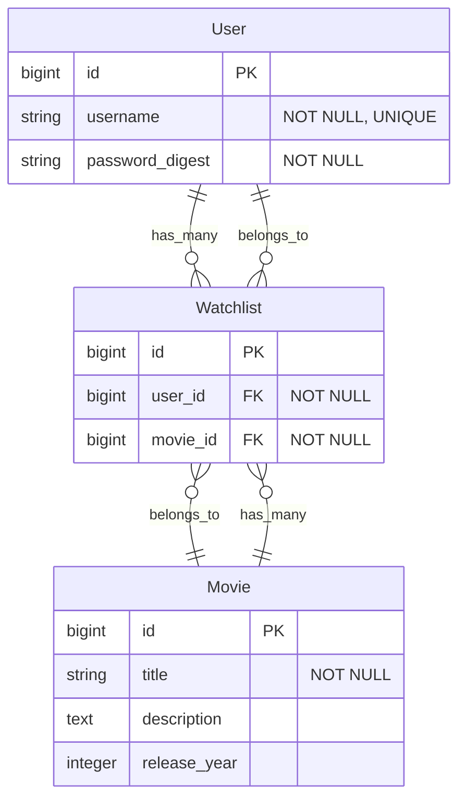

# TODO:
- ✅ Model test
- Implement API
- JWT auth
- OpenAPI doc (swagger)

# Rails Movie API

A RESTful movie API with OpenAPI and JWT auth.

## Tech Stack

- Ruby 3.3.8 / Rails 8.0.2
- PostgreSQL 16.9
- Docker 28.3.2 / Docker Compose v2.38.2

## Setup Instructions

### Using Docker

```bash
# 1. Clone the project repository
git clone <repository-url>

# 2. Navigate to the project directory
cd <repository-name>

# 3. Start the application
docker compose up

# 4. Visit http://localhost:3000
```

### Local Development

```bash
# 1. Install dependencies
bundle install

# 2. Setup database
bin/rails db:prepare # (db:create + db:migrate + db:seed)

# 3. Start the server
bin/rails server
```

---

## Testing

```bash
# Using Docker
docker compose run test

# Local Development
bundle exec rspec
```

## Database Schema

### ER Diagram



*Note: Standard Rails timestamps (created_at, updated_at) are omitted from the diagram for clarity*

### Constraints
- `(user_id, movie_id)` combination must be unique in Watchlists


---

This README would normally document whatever steps are necessary to get the
application up and running.

Things you may want to cover:

* Ruby version

* System dependencies

* Configuration

* Database creation

* Database initialization

* How to run the test suite

* Services (job queues, cache servers, search engines, etc.)

* Deployment instructions

* ...
